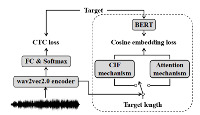
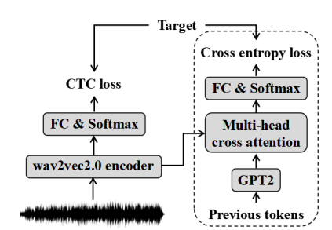

Knowledge Transferring (KT) module for train ASR
========================
This repository represents PyTorch implementation of 
[**"Improving CTC-based speech recognition via knowledge transferring from pre-trained language models"**](https://arxiv.org/abs/2203.03582) <br/>

Knowledge Transferring (KT) implies usage of Language Model (LM) 
knowledge for train encoder (Wav2Vec). 
***

There are two methods to train ASR Encoder: <br/>
* **Representation Learning (RL)**  
    `kt_module/repr_learning.py` <br/>

* **Classification Learning (CL)** - *is not implemented yet* <br/>

***

## Representation Learning (RL) ##
It uses [BERT](https://arxiv.org/abs/1810.04805) and provides two mechanisms: 
* **CIF** ([Paper](https://arxiv.org/pdf/1905.11235.pdf), [GitHub](https://github.com/MingLunHan/CIF-PyTorch)) <br/>
    `kt_module/cif.py` <br/>
* **Attention** ([PyTorch](https://pytorch.org/docs/stable/generated/torch.nn.MultiheadAttention.html)) <br/>
    `kt_module/attention.py` <br/>
***

## Classification Learning (CL) ##
Soon
***

## Example of usage ##
```python
import torch
from kt_module import from_yaml

train_module = from_yaml('config.yaml')

# Encoder outputs (from Wav2Vec)
# B - batch size
# L - max seq len
# H - encoder out dim
B, L, H = 3, 10, 768
encoder_outputs = torch.rand(B, L, H, dtype=torch.float32, 
                                      requires_grad=True)
mask = torch.ones(B, L, dtype=torch.bool)  # 0 value means invalid

target_sentences = [
    'привет как дела',
    'что нового',
    'давай пока'
]
assert B == len(target_sentences)

losses = train_module(encoder_outputs, mask, target_sentences)
# loss = ctc_loss + [weighted sum of these losses]
# (see eq.4 and eq.7 in paper)

# loss.backward()
```


